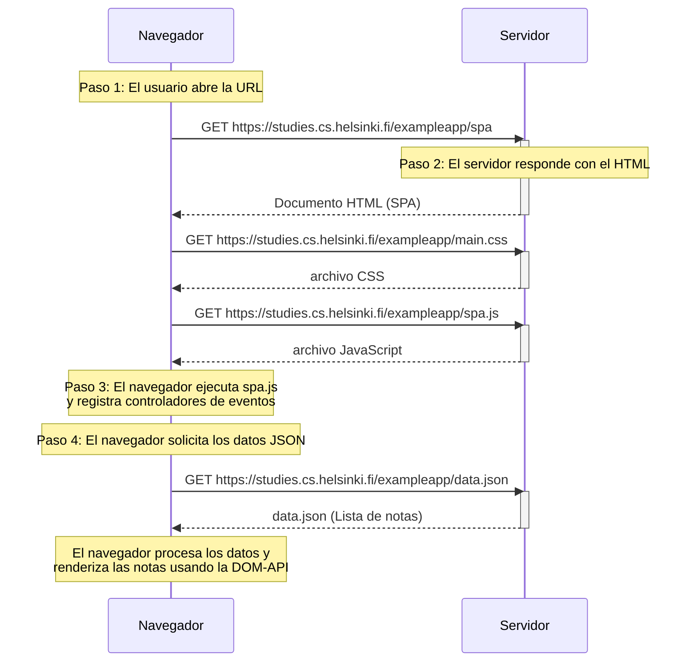

# Diagrama de carga de una aplicación de una sola página (SPA)

```mermaid
sequenceDiagram
    participant Navegador
    participant Servidor

    Note over Navegador: Paso 1: El usuario abre la URL
    Navegador->>Servidor: GET https://studies.cs.helsinki.fi/exampleapp/spa
    
    activate Servidor
    Note over Servidor: Paso 2: El servidor responde con el HTML
    Servidor-->>Navegador: Documento HTML (SPA)
    deactivate Servidor

    Navegador->>Servidor: GET https://studies.cs.helsinki.fi/exampleapp/main.css
    activate Servidor
    Servidor-->>Navegador: archivo CSS
    deactivate Servidor

    Navegador->>Servidor: GET https://studies.cs.helsinki.fi/exampleapp/spa.js
    activate Servidor
    Servidor-->>Navegador: archivo JavaScript
    deactivate Servidor

    Note over Navegador: Paso 3: El navegador ejecuta spa.js<br/>y registra controladores de eventos

    Note over Navegador: Paso 4: El navegador solicita los datos JSON
    Navegador->>Servidor: GET https://studies.cs.helsinki.fi/exampleapp/data.json
    activate Servidor
    Servidor-->>Navegador: data.json (Lista de notas)
    deactivate Servidor

    Note over Navegador: El navegador procesa los datos y<br/>renderiza las notas usando la DOM-API
```
