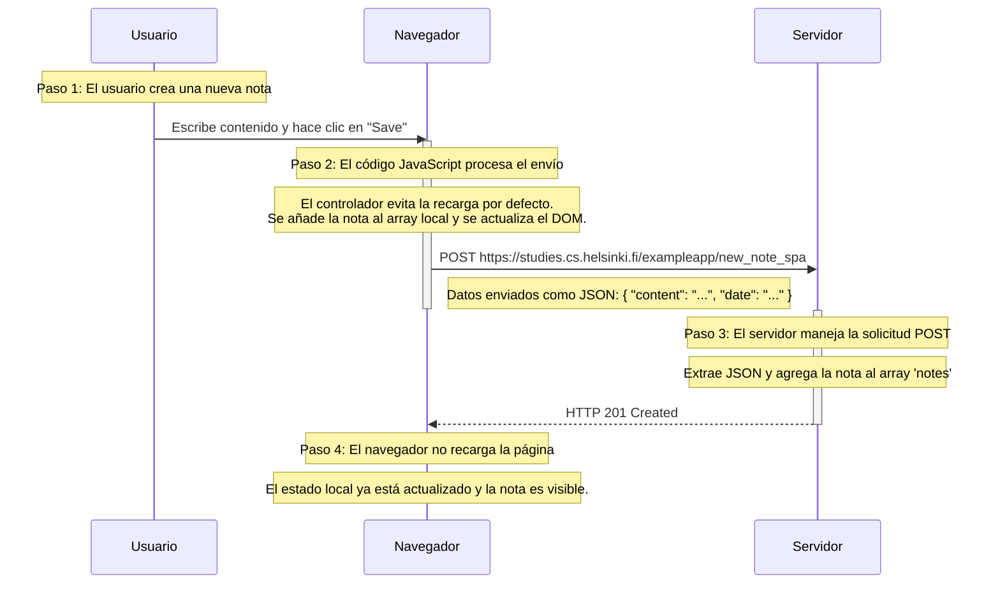

# Diagrama de creación de una nueva nota en una SPA

```mermaid
sequenceDiagram
    participant Usuario
    participant Navegador
    participant Servidor

    Note over Usuario: Paso 1: El usuario crea una nueva nota
    Usuario->>Navegador: Escribe contenido y hace clic en "Save"
    
    activate Navegador
    Note over Navegador: Paso 2: El código JavaScript procesa el envío
    Note over Navegador: El controlador evita la recarga por defecto.<br/>Se añade la nota al array local y se actualiza el DOM.

    Navegador->>Servidor: POST https://studies.cs.helsinki.fi/exampleapp/new_note_spa
    Note right of Navegador: Datos enviados como JSON: { "content": "...", "date": "..." }
    deactivate Navegador

    activate Servidor
    Note over Servidor: Paso 3: El servidor maneja la solicitud POST
    Note over Servidor: Extrae JSON y agrega la nota al array 'notes'
    Servidor-->>Navegador: HTTP 201 Created
    deactivate Servidor

    Note over Navegador: Paso 4: El navegador no recarga la página
    Note over Navegador: El estado local ya está actualizado y la nota es visible.
```
